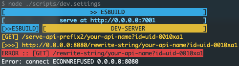

# esbuild-dev-serve
[esbuild](https://esbuild.github.io/) plugin for development html.

> Like webpack-dev-server. 
>
> Use esbuild with a development server that provides statics and api proxy. This should be used for development only.

<br>

> #### Install

---

```bash
# npm
npm install esbuild-dev-serve -D

# yarn
yarn add esbuild-dev-serve -D
```

<br>

> #### Usage

---
### Simple Setting

esbuild **dev.settings.js**

```javascript
import esbuild from 'esbuild';
import DevServe from 'esbuild-dev-serve'

const esbuild_settings = {
  ... your basic esbuild settings ...
};

const serve = {
  port: 3005,
  servedir: 'public',
  proxy: {
    '/serve-api-prefix1': 'http://xxx.xxx.x.xxx:xxxx',
    '/serve-api-prefix2': {
      target: 'http://xxx.xxx.x.xxx:xxxx',
      stream: ['/serve-api-prefix2', '/rewrite-string'],
    },
  }
};

DevServe(esbuild, serve, esbuild_settings);

```

dev-server working info logs.




<h2 align="center">Proxy Configs</h2>

```js
proxy: {
  '/serve-api-prefix1': 'http://xxx.xxx.x.xxx:xxxx',
  '/serve-api-prefix2': {
    target: 'http://xxx.xxx.x.xxx:xxxx',
    stream: ['/serve-api-prefix2', '/rewrite-string'],
  },
}
```

---


> powered by Zonebond of Oneteams studio F2D (F2D is "front-end design and development" team)<br>

> author <zonebond@126.com>

> 知乎 https://www.zhihu.com/people/zonebond/posts

